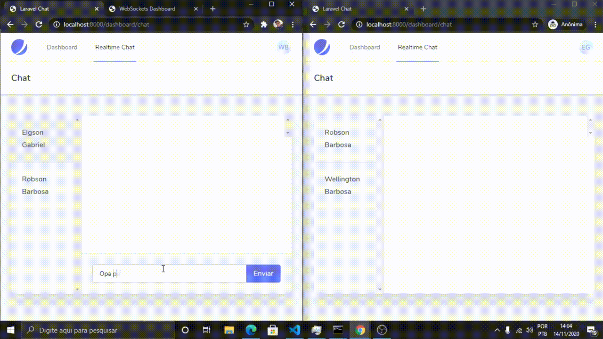

# Realtime WebChat


**Antes de tudo: se achou a aplicação legal, dê uma estrelinha no repositório ❤️**

## Sobre o Projeto

Esta foi uma aplicação rápida desenvolvida para entender melhor como o Laravel trabalha em conjunto com Vue.js e Inertia.js, além de entender como funciona o Laravel WebSockets. É interessante ressaltar que o **realtime** desenvolvido na aplicação **não depende** de nenhuma API externa paga, como [pusher](https://pusher.com) por exemplo. 

Através do Laravel WebSockets, é gerado um servidor local para realizar o websocket 👌

### Tecnologias Utilizadas

- Laravel 8.x
- Vue.js 
- Inertia.js
- Tailwind Css

### Tempo de Desenvolvimento
- Entre 7 a 9 horas

## Rodando o Projeto em Sua Máquina Local
**Requisitos: Pilha [LAMPP ou XAMPP](https://www.apachefriends.org/index.html) | [Composer](https://getcomposer.org/download/) | [NPM](https://nodejs.org/en/download/)**

### Etapas
1. Clone o repositório
```
git clone https://github.com/wellingtoncarneirobarbosa/laravel-chat.git
```

2. Instale as dependências PHP
```
composer install
```

3. Instale as dependências JS
```
npm install
```

4. Faça o build dos pacotes js
```
npm run dev
```

5. Crie um arquivo .env na raiz do projeto com o conteúdo do arquivo [.env.example](./.env.example)

6. Crie um banco de dados chamado "laravel-chat"
Ps. <i>É importante que o charset utilizado no banco seja o <b>utf8mb4_general_ci</b>, ou sua aplicação
não terá suporte a emojis. E todo mundo ama emojis</i>

7. Gere a chave de sessão da aplicação
```
php artisan key:generate
```

8. Faça as publicações das tabelas em seu banco de dados
```
php artisan migrate
```

9. Levante um servidor web
```
php artisan serve
```

10. Em outro terminal, levante um servidor websocket
```
php artisan websocket:serve
```

11. [Clique Aqui](http://localhost:8000/laravel-websockets) ou em seu navegador abra "http://localhost:8000/laravel-websockets" e clique em "Connect" 

12. [Clique Aqui](http://localhost:8000/register) ou em seu navegador abra "http://localhost:8000/register" e cadastre alguns usuários

13. [Clique Aqui](http://localhost:8000/dashboard/chat) ou em seu navegador abra "http://localhost:8000/dashboard/chat" e teste o realtime chat :) 
**O realtime fica ainda mais legal se você abrir uma aba anônima logado com outro usuário e testar o chat hehe**

## Autor
<a href="https://github.com/wellingtoncarneirobarbosa" target="_blank">
 Wellington Barbosa
</a>
<br>
<a href="https://instagram.com/owellcarneiro" target="_blank">
Instagram
</a>
|
<a href="https://linkedin.com/in/wellingtoncarneirobarbosa" target="_blank">
LinkedIn
</a>
|
<a href="https://facebook.com/owellcarneiro" target="_blank">
Facebook
</a>


## Licença

Este é um projeto de estudo e está sob a [Licença MIT](https://opensource.org/licenses/MIT).
